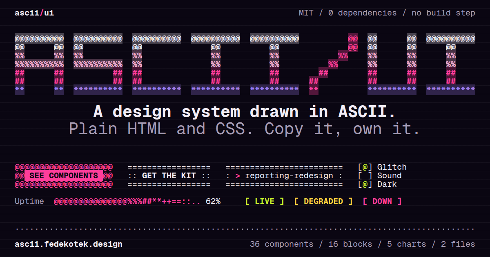

# ascii/ui

**A design system drawn in ASCII.** shadcn-style components wearing a brutalist skin with a bad signal. Frames, fills and shadows are strings of characters, weight comes from how dense a character is, every state change glitches a little, and underneath it is plain, accessible HTML.

[](https://ascii.fedekotek.design)

**[Live site](https://ascii.fedekotek.design)** · [Components](https://ascii.fedekotek.design/#components) · [Starter page](https://ascii.fedekotek.design/kit/starter.html) · [Kit reference](kit/README.md) · [Changelog](kit/CHANGELOG.md)

- **36 components, 16 blocks, 5 charts.** 34 of the 36 components are in the kit. Command and Picture need the site's engine.
- **Two files.** `ascii-ui.css` and `ascii-ui.js`. No dependencies, no build step, no framework, no package to install.
- **Copy it, own it.** Every component has a Code tab with the HTML to paste and a Usage tab: when to use it, anatomy, states, keys, accessibility, do and don't.
- **The kit asks no one.** The font (Geist Mono) is self-hosted. No CDN, no font service, no trackers. (The site itself counts visits with Vercel Web Analytics: cookieless, same origin, off under Do Not Track.)
- **Accessible under the paint.** Native controls with labels, a visible focus state and a keyboard. Reduced motion turns off every animation and sound. Target: WCAG 2.2 AA, see [ACCESSIBILITY.md](docs/ACCESSIBILITY.md).

## Start in 30 seconds

Link the two kit files in the `<head>` of your page. Pinned to 1.3.0, so they never change under you:

```html
<link rel="stylesheet" href="https://ascii.fedekotek.design/kit/1.3.0/ascii-ui.css" integrity="sha384-PVsKFGhvH5P6JvqNhZ40Neu/9zBE5XoUAKklGDs1jVGq6of6rC+P9SaLcDKVFoA4" crossorigin="anonymous">
<script defer src="https://ascii.fedekotek.design/kit/1.3.0/ascii-ui.js" integrity="sha384-zWLWXMf44ZiHudahDdB25irvp6Lm0TN9/l4r2TlB83GVVnJcRSX2z031lFHBG0T+" crossorigin="anonymous"></script>
```

Then open [Components](https://ascii.fedekotek.design/#components), pick the Code tab on any component and paste its HTML into your page. It works as pasted, twice on one page too. Or start from the [starter page](https://ascii.fedekotek.design/kit/starter.html), which already links both files and has every kit component on it.

The latest version, which moves with every release, is at `https://ascii.fedekotek.design/kit/ascii-ui.css` and `.../kit/ascii-ui.js`. Prefer your own copies? Download the two files and the `fonts/` folder from [`kit/`](kit/) and serve them yourself.

The kit's reference (the `data-aui` attributes, the `window.ASCIIUI` API, events, tokens, versions and pinned URLs) is [`kit/README.md`](kit/README.md).

## What is on the site

Five views. Search is `/` or Ctrl K, and every section has an address (`#components/button`).

| View | What is there |
|---|---|
| [Home](https://ascii.fedekotek.design/#home) | The ring, where to start, questions, how it was made, invaders. |
| [Components](https://ascii.fedekotek.design/#components) | Get the kit, then 36 components in five groups (Form, Overlay, Display, Feedback, Navigation), each with Preview, Code and Usage. |
| [Blocks](https://ascii.fedekotek.design/#blocks) | 16 page-sized compositions: login, stats, table, pricing, settings and more. |
| [Charts](https://ascii.fedekotek.design/#charts) | 5 charts drawn on the character grid. In the kit they read a `<table>`, so the data shows without the script. |
| [Themes](https://ascii.fedekotek.design/#themes) | Presets, colors, the ramp editor, tokens (and `tokens.json` for design tools), Signal (the opt-in effects layer) and Labs. |

The whole site also ships as one HTML file that works offline: the Download link in its footer.

## Working on it

No frameworks, no bundler, no package manager. Vanilla HTML, CSS and JS, and Python 3 (standard library) for the build.

```sh
python3 -m http.server 8000     # then http://localhost:8000 (file:// works too, minus camera and clipboard)
python3 build.py                # writes dist/ascii-ui.html and site/, the folder Vercel serves
```

QA is Playwright for Python. The release bar is one command and must end with `release: ok`:

```sh
pip install playwright && playwright install chromium
python3 qa/qa.py 390 844 dark m x   # the quick check: errors and overflow on every view
sh qa/release.sh                    # everything, in order, stops at the first failure
```

Every script is described in [`qa/README.md`](qa/README.md).

```
index.html     the page, linking css/ and js/ (develop here)
css/           24 stylesheets, loaded in the order they are numbered (29-print last)
js/            8 scripts, one IIFE each, loaded in the order they are numbered
kit/           what you link from your own page: ascii-ui.css, ascii-ui.js, starter.html, README.md,
               fonts/, and every pinned version in releases/
build.py       inlines css/ and js/ into one file and writes site/
site/          the deploy output (committed, Vercel has no build step): the page, the kit, the assets
dist/          the single-file build, for opening from disk
qa/            the Playwright checks, the release bar and the reference generator
docs/          how it works and how to keep it going (start with ARCHITECTURE.md)
assets/        the share card, the icons, the reel on Home and the font subset
llms.txt       a one-page map for an AI agent (llms-full.txt: every component in full)
CLAUDE.md      the rules and the checklists, for an AI agent or a person
```

| Want to | Go to |
|---|---|
| Understand how it fits together | [`docs/ARCHITECTURE.md`](docs/ARCHITECTURE.md) |
| Change a color, the ramp, a preset | `css/01-tokens.css`, `js/00-tones.js`, [`docs/TOKENS.md`](docs/TOKENS.md) |
| Rebrand (every place a color lives) | [`docs/ARCHITECTURE.md`](docs/ARCHITECTURE.md), Rebrand |
| Add a component | [`docs/COMPONENTS.md`](docs/COMPONENTS.md), the checklist |
| See every component's code, as printed | [`docs/COMPONENTS-REFERENCE.md`](docs/COMPONENTS-REFERENCE.md), generated by `qa/reference.py` |
| Change the kit | `kit/`, then `python3 qa/kit.py sync` |
| Add a block or a chart | [`docs/BLOCKS.md`](docs/BLOCKS.md), [`docs/CHARTS.md`](docs/CHARTS.md) |
| Understand a trick (torus, tear, LCD, shatter, ramp swap) | [`docs/EFFECTS.md`](docs/EFFECTS.md) |
| Draw an icon | [`docs/ICONS.md`](docs/ICONS.md) |
| The JS surface (`window.AUI`) | [`docs/API.md`](docs/API.md) |
| See what is fragile | [`docs/KNOWN-ISSUES.md`](docs/KNOWN-ISSUES.md) |
| Know what is accessible and what is not | [`docs/ACCESSIBILITY.md`](docs/ACCESSIBILITY.md) |
| Know why something is the way it is | [`docs/DECISIONS.md`](docs/DECISIONS.md) |
| Decide what to do next | [`docs/ROADMAP.md`](docs/ROADMAP.md) |
| See how it got here | [`docs/CHANGELOG.md`](docs/CHANGELOG.md) |

## Contributing and security

Issues and pull requests are welcome. Read [`docs/CONTRIBUTING.md`](docs/CONTRIBUTING.md) first: keep it small, keep it dependency free, and run the release bar. To report a vulnerability, see [`SECURITY.md`](SECURITY.md).

## License and credits

Code under the [MIT license](LICENSE). Geist Mono by Vercel, under the [SIL Open Font License 1.1](assets/fonts/OFL.txt).

Designed by [Fede Kotek](https://fedekotek.design). Built with Claude Code.
